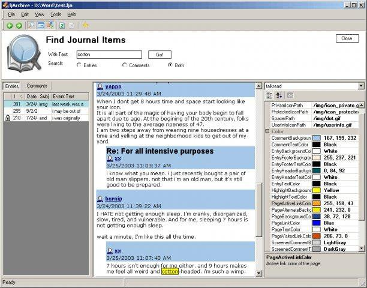
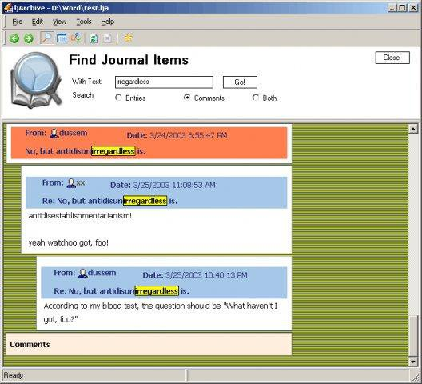
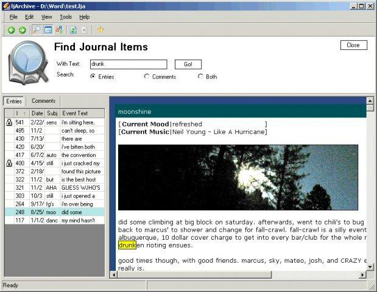

ljArchive
===

ljArchive is a tool for downloading, browsing, and analyzing journal entries and comments from LiveJournal (or LiveJournal clones).

Origin
---

Original license is [zlib/libpng License](https://opensource.org/licenses/Zlib)

Original project is [ljarchive](https://sourceforge.net/projects/ljarchive/)

Original source code is [here](http://svn.code.sf.net/p/ljarchive/code/trunk/)

Screenshots
---

Fork Changes
---

* Updated to support Visual Studio 2019 Community
* Remove AgentObjects
* Remove legacy cookies
* Some other fixes to be able to run in Windows 10 environment